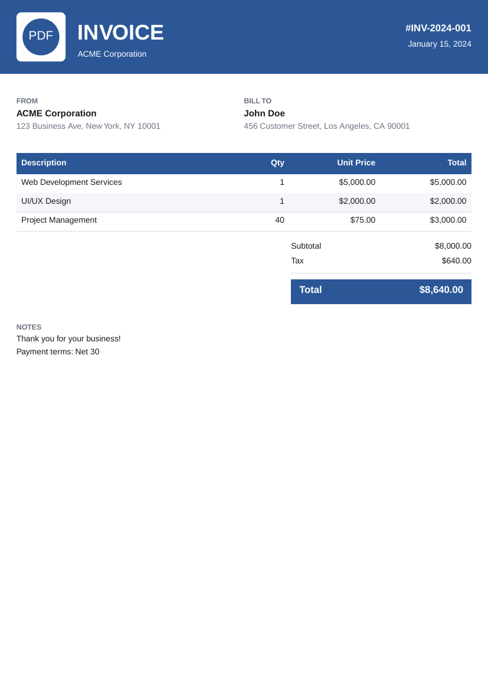
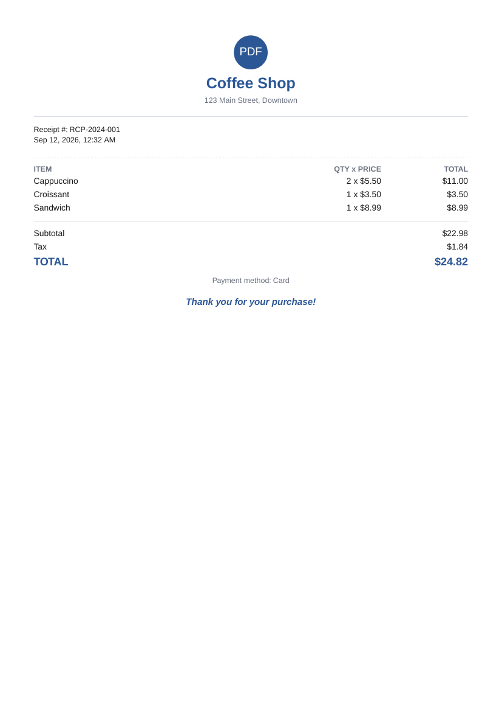
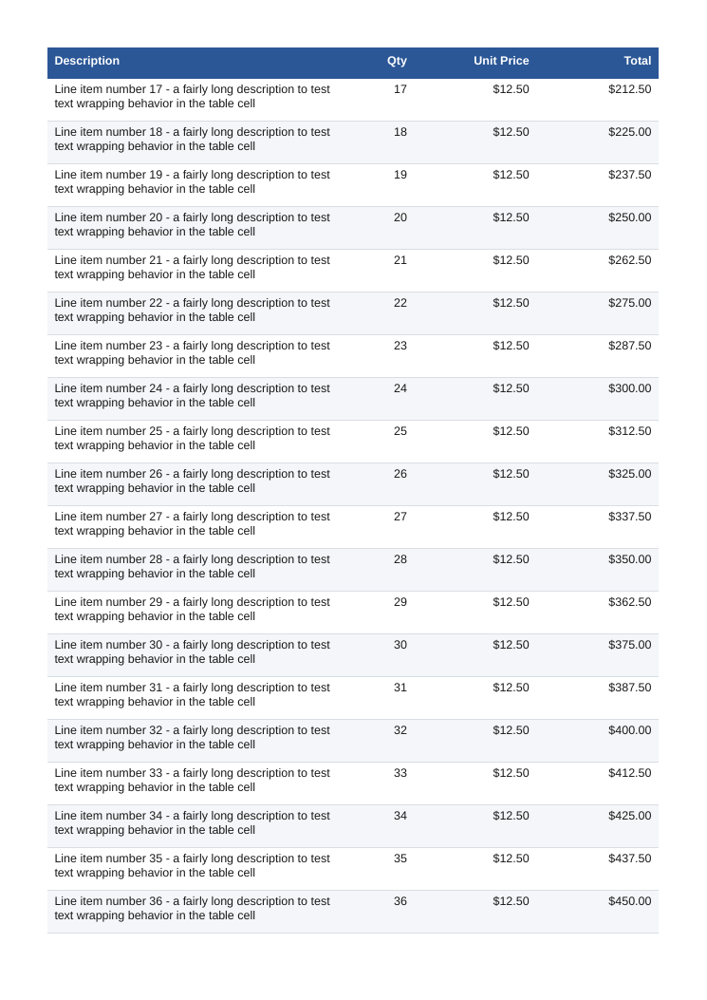
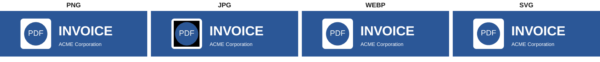

# Universal PDF Gen

A zero-bloat, multi-language PDF generation toolkit with professionally designed, ready-to-use templates and a fully programmatic API — available for **JavaScript/TypeScript (Node.js)** and **Python**.

Generate invoices, receipts, and certificates that look like they came from a real design system, not a "Hello World" PDF tutorial — with word-wrapped tables, automatic pagination, page-size-aware layouts, and a shared color theme you can override.

---

## Table of Contents

1. [What it looks like](#what-it-looks-like)
2. [How it works](#how-it-works)
3. [Features](#features)
4. [Installation](#installation)
5. [Quick Start — JavaScript/TypeScript](#quick-start--javascripttypescript)
6. [Quick Start — Python](#quick-start--python)
7. [CLI Usage](#cli-usage)
8. [Templates Reference](#templates-reference)
9. [Configuration Options](#configuration-options)
10. [Theming](#theming)
11. [Logos & Images](#logos--images)
12. [Custom Templates — Build Your Own Design](#custom-templates--build-your-own-design)
13. [Multi-page Invoices & Pagination](#multi-page-invoices--pagination)
14. [Project Structure](#project-structure)
15. [Development & Tests](#development--tests)
16. [Troubleshooting](#troubleshooting)
17. [License](#license)

---

## What it looks like

These are real, unmodified outputs generated by the library — not mockups.

### Invoice



### Receipt



### Certificate


### Automatic pagination (page 2 of a 40-line-item invoice)

When content overflows a page, the table header repeats automatically and row striping continues seamlessly:



> The JavaScript and Python implementations render **pixel-identical output** — same theme, same layout math, same pagination behavior — so you can pick whichever language fits your stack without compromising on design.

### Logo support — PNG, JPG, WEBP, and SVG all work

The invoice above has a real logo embedded (`examples/assets/logo.svg`) — not a placeholder. All four major image formats are supported and produce equivalent output:



> The black corners on the JPG sample are expected, not a bug — JPEG has no alpha channel, so a logo with a transparent background gets a solid background when saved as JPEG. Use PNG, WEBP, or SVG if your logo needs transparency.

---

## How it works

```
┌─────────────────────┐        ┌──────────────────────┐
│   Your application   │        │   Your application    │
│  (Node.js / TS code)  │        │   (Python code)        │
└──────────┬───────────┘        └──────────┬─────────────┘
           │                               │
           ▼                               ▼
  ┌────────────────────┐         ┌─────────────────────┐
  │   pdf-gen-js         │         │   pdf-gen (Python)    │
  │  PDFGenerator class   │         │  PDFGenerator class   │
  └──────────┬───────────┘         └──────────┬───────────┘
           │  .useTemplate(name, data)                │  .use_template(name, data)
           ▼                                          ▼
  ┌─────────────────────────────────────────────────────────┐
  │        Template renderer (invoice / receipt / cert)        │
  │   draws onto the page using the shared Theme + layout      │
  │   math: banner header, FROM/BILL TO, word-wrapped table,    │
  │   totals box, notes footer — auto page-breaking as needed   │
  └──────────────────────────┬──────────────────────────────┘
                              ▼
                     generate('output.pdf')
                              ▼
                        Finished PDF file
```

Both packages share the **same conceptual pipeline**:

1. You create a `PDFGenerator` with page size, orientation, margins, and optional theme colors.
2. You register (or use the built-in) templates: `invoice`, `receipt`, `certificate`.
3. You call `useTemplate(name, data)` / `use_template(name, data)` with your data — the renderer handles layout, word-wrapping, currency/date formatting, and automatic pagination.
4. You call `generate('file.pdf')` to write the file to disk (or get an in-memory buffer for HTTP responses).

The 3 built-in templates are not the whole story — `registerTemplate`/`register_template` accepts **any** renderer function of your own, so you can design your own PDF from scratch and still get page-size resolution, theming, and the low-level drawing helpers (`addText`, `addTable`, `addLine`, `addRect`, `addImage`) for free. See [Custom Templates](#custom-templates--build-your-own-design) below.

---

## Features

- 🌐 **Multi-language** — first-class JavaScript/TypeScript and Python packages with matching APIs and matching visual output
- 🧾 **3 professional templates** — Invoice, Receipt, Certificate — with a real visual hierarchy (banner headers, colored accents, striped tables), not plain black-and-white text dumps
- 🎨 **Bring your own design** — register a fully custom template (business cards, tickets, reports, anything) and get theming, page-size resolution, and the drawing helpers for free — you're never locked into the 3 built-ins
- 🖼 **Logos in PNG, JPG, WEBP, or SVG** — drop a `logo` field into any template; SVG is embedded as true vector paths (not rasterized), so it stays crisp at any size
- 📐 **Configurable page setup** — A4, Letter, A3, A5, portrait or landscape, custom margins
- 🎨 **Themeable** — override the primary color, accent color, table colors, etc. per document
- 📊 **Smart tables** — automatic word-wrapping per cell, striped rows, and automatic page breaks that reprint the header on the next page
- ✅ **Input validation** — missing required fields raise a clear error immediately instead of producing a broken PDF
- 🗓 **Flexible dates** — pass a native `Date`/`datetime` or a plain string (`"2024-01-15"`); it's normalized and formatted for you
- 💵 **Currency formatting** — built-in `Intl`/locale-aware currency formatting
- 🔧 **CLI tools** in both languages for generating PDFs from a JSON file without writing code
- 📄 **In-memory buffers** — generate PDFs straight into a `Buffer`/`bytes` for HTTP responses, no temp files required
- 🧩 **Mature PDF engines underneath** — JS wraps [PDFKit](http://pdfkit.org/) + [sharp](https://sharp.pixelplumbing.com/)/[svg-to-pdfkit](https://www.npmjs.com/package/svg-to-pdfkit) for images, Python wraps [ReportLab](https://www.reportlab.com/) + [Pillow](https://python-pillow.org/)/[svglib](https://github.com/deeplook/svglib)

---

## Installation

### JavaScript/TypeScript

```bash
cd packages/pdf-gen-js
npm install
npm run build
```

> Once published to npm, this will simply be `npm install pdf-gen-js`.

### Python

```bash
cd packages/pdf-gen-py
pip install -e .
```

> Once published to PyPI, this will simply be `pip install pdf-gen`.

**Requirements:** Node.js ≥ 16 for the JS package, Python ≥ 3.8 for the Python package.

---

## Quick Start — JavaScript/TypeScript

**Step 1 — Import and create a generator:**

```javascript
const { PDFGenerator, Templates } = require('pdf-gen-js');

const pdf = new PDFGenerator({
  pageSize: 'A4',          // 'A4' | 'Letter' | 'A3' | 'A5'
  orientation: 'portrait', // 'portrait' | 'landscape'
  margins: { top: 40, bottom: 40, left: 40, right: 40 }
});
```

**Step 2 — Register the built-in templates:**

```javascript
Templates.register(pdf);
```

**Step 3 — Fill in your data and render:**

> `useTemplate` is `async` (image embedding may need to decode/convert a file), so `await` it before calling `generate()`.

```javascript
await pdf.useTemplate('invoice', {
  invoiceNumber: 'INV-2024-001',
  date: '2024-01-15',            // Date object or string — both work
  dueDate: '2024-02-14',
  status: 'DUE',                 // 'PAID' | 'DUE' | 'OVERDUE'
  logo: 'logo.svg',              // optional — .png, .jpg, .webp, or .svg
  companyName: 'ACME Corporation',
  companyAddress: '123 Business Ave, New York, NY 10001',
  clientName: 'John Doe',
  clientAddress: '456 Customer Street, Los Angeles, CA 90001',
  items: [
    { description: 'Web Development Services', quantity: 1, unitPrice: 5000 },
    { description: 'UI/UX Design', quantity: 1, unitPrice: 2000 }
  ],
  subtotal: 7000,
  tax: 560,
  taxRate: 8,
  total: 7560,
  notes: 'Thank you for your business!',
  paymentTerms: 'Net 30'
});
```

**Step 4 — Write the file:**

```javascript
await pdf.generate('invoice.pdf');
console.log('Done!');
```

Run the full working example (produces all three templates):

```bash
node examples/example.js
```

---

## Quick Start — Python

**Step 1 — Import and create a generator:**

```python
from pdf_gen import PDFGenerator, Templates

pdf = PDFGenerator(
    page_size='A4',
    orientation='portrait',
    margins={'top': 40, 'bottom': 40, 'left': 40, 'right': 40}
)
```

**Step 2 — Register the built-in templates:**

```python
Templates.register(pdf)
```

**Step 3 — Fill in your data and render:**

```python
pdf.use_template('invoice', {
    'invoice_number': 'INV-2024-001',
    'date': '2024-01-15',            # datetime object or string — both work
    'due_date': '2024-02-14',
    'status': 'DUE',                 # 'PAID' | 'DUE' | 'OVERDUE'
    'logo': 'logo.svg',              # optional — .png, .jpg, .webp, or .svg
    'company_name': 'ACME Corporation',
    'company_address': '123 Business Ave, New York, NY 10001',
    'client_name': 'John Doe',
    'client_address': '456 Customer Street, Los Angeles, CA 90001',
    'items': [
        {'description': 'Web Development Services', 'quantity': 1, 'unit_price': 5000},
        {'description': 'UI/UX Design', 'quantity': 1, 'unit_price': 2000}
    ],
    'subtotal': 7000,
    'tax': 560,
    'tax_rate': 8,
    'total': 7560,
    'notes': 'Thank you for your business!',
    'payment_terms': 'Net 30'
})
```

**Step 4 — Write the file:**

```python
pdf.generate('invoice.pdf')
print('Done!')
```

Run the full working example (produces all three templates):

```bash
python3 examples/example.py
```

> **Naming convention note:** the JS package uses `camelCase` keys (`invoiceNumber`) and the Python package uses `snake_case` keys (`invoice_number`) to stay idiomatic in each language. See `examples/js-data/` vs `examples/py-data/` for side-by-side sample payloads.

---

## CLI Usage

Both packages ship a command-line tool that generates a PDF straight from a JSON file — no code required.

### JavaScript CLI

```bash
node packages/pdf-gen-js/bin/cli.js invoice output.pdf \
  --config examples/js-data/invoice-data.json \
  --page-size A4 \
  --orientation portrait
```

### Python CLI

```bash
cd packages/pdf-gen-py
python3 -m pdf_gen.cli invoice output.pdf \
  --config ../../examples/py-data/invoice-data.json \
  --page-size A4 \
  --orientation portrait
```

Both CLIs also accept a `--logo <file>` flag that sets/overrides the `logo` field from `--config`:

```bash
pdf-gen invoice invoice.pdf --config invoice-data.json --logo logo.svg
```

Once installed as packages, both expose a `pdf-gen` binary on your `PATH`:

```bash
pdf-gen receipt receipt.pdf --config receipt-data.json
pdf-gen certificate cert.pdf --config cert-data.json --orientation landscape
```

---

## Templates Reference

### Invoice

| Field (JS / Python) | Type | Required | Description |
|---|---|---|---|
| `invoiceNumber` / `invoice_number` | string | ✅ | Displayed in the header |
| `date` | string \| Date/datetime | | Invoice date, defaults to today |
| `dueDate` / `due_date` | string \| Date/datetime | | Optional due date line |
| `status` | `'PAID'` \| `'DUE'` \| `'OVERDUE'` | | Colored status badge |
| `logo` | path/bytes, or `{src, width, height}` — see [Logos & Images](#logos--images) | | Shown top-left in the header banner |
| `companyName` / `company_name` | string | ✅ | Your business name |
| `companyAddress` / `company_address` | string | | |
| `clientName` / `client_name` | string | ✅ | Billed-to party |
| `clientAddress` / `client_address` | string | | |
| `items` | array of `{ description, quantity, unitPrice/unit_price, total? }` | ✅ | Line items — `total` is computed automatically if omitted |
| `subtotal` | number | ✅ | |
| `tax` | number | | |
| `taxRate` / `tax_rate` | number | | Shown as `Tax (N%)` next to the tax amount |
| `total` | number | ✅ | |
| `currency` | string (`'USD'`, `'EUR'`, ...) | | Defaults to `USD` |
| `notes` | string | | |
| `paymentTerms` / `payment_terms` | string | | |

Renders a colored header banner, FROM/BILL TO columns, a word-wrapped and striped line-items table, a totals box, and a notes section — automatically flowing onto additional pages for long item lists.

### Receipt

| Field (JS / Python) | Type | Required |
|---|---|---|
| `storeName` / `store_name` | string | ✅ |
| `logo` | path/bytes, or `{src, width, height}` | |
| `storeAddress` / `store_address` | string | |
| `receiptNumber` / `receipt_number` | string | ✅ |
| `dateTime` / `datetime` | string \| Date/datetime | |
| `items` | array of `{ name, quantity, price, total? }` | ✅ |
| `subtotal` | number | ✅ |
| `tax` | number | |
| `total` | number | ✅ |
| `currency` | string | |
| `paymentMethod` / `payment_method` | string | ✅ |
| `thankYouMessage` / `thank_you_message` | string | |

Renders a compact, centered receipt layout with a dashed item separator, suitable for narrower page sizes too.

### Certificate

| Field (JS / Python) | Type | Required |
|---|---|---|
| `title` | string | ✅ |
| `logo` | path/bytes, or `{src, width, height}` | |
| `recipientName` / `recipient_name` | string | ✅ |
| `achievementText` / `achievement_text` | string | ✅ |
| `issuerName` / `issuer_name` | string | ✅ |
| `issueDate` / `issue_date` | string \| Date/datetime | |
| `certificationNumber` / `certification_number` | string | |
| `borderColor` / `border_color` | hex color string | |
| `decorativeElements` / `decorative_elements` | boolean (default `true`) | |

Renders a full-bleed decorative double border with accent-colored corner dots, correctly scaled to whatever page size/orientation you configure (no hardcoded coordinates).

**All three templates validate their required fields up front** — if you forget `clientName`/`client_name` on an invoice, for example, you get:

```
Error: Missing required field(s) for "invoice" template: clientName, items
```

instead of a corrupted or blank PDF.

---

## Configuration Options

| Option (JS / Python) | Values | Default |
|---|---|---|
| `pageSize` / `page_size` | `'A4'` \| `'Letter'` \| `'A3'` \| `'A5'` | `'A4'` |
| `orientation` | `'portrait'` \| `'landscape'` | `'portrait'` |
| `margins` | `{ top, bottom, left, right }` in points | `40` on all sides |
| `theme` | see [Theming](#theming) | built-in blue/gold theme |

---

## Theming

Every template pulls its colors from a shared `Theme`. Override any subset when creating the generator:

**JavaScript:**

```javascript
const pdf = new PDFGenerator({
  theme: {
    primary: '#7a2048',
    accent: '#d4af37',
    tableHeaderBg: '#7a2048'
  }
});
```

**Python:**

```python
from pdf_gen import PDFGenerator, Theme

pdf = PDFGenerator(theme=Theme(primary='#7a2048', accent='#d4af37', table_header_bg='#7a2048'))
```

Available theme keys: `primary`, `primaryDark`/`primary_dark`, `accent`, `text`, `muted`, `border`, `tableHeaderBg`/`table_header_bg`, `tableHeaderText`/`table_header_text`, `tableStripeBg`/`table_stripe_bg`, `background`.

---

## Logos & Images

Every template accepts an optional `logo` field. All four major formats are supported:

| Format | JS handling | Python handling |
|---|---|---|
| PNG | Embedded natively by PDFKit | Embedded natively via Pillow/`ImageReader` |
| JPG/JPEG | Embedded natively by PDFKit | Embedded natively via Pillow/`ImageReader` |
| WEBP | Transparently normalized to PNG via [`sharp`](https://sharp.pixelplumbing.com/) (PDFKit has no native WEBP support) | Decoded directly by Pillow (standard wheels ship with WEBP support) |
| SVG | Drawn as **true vector paths** via [`svg-to-pdfkit`](https://www.npmjs.com/package/svg-to-pdfkit) — not rasterized | Drawn as **true vector paths** via [`svglib`](https://github.com/deeplook/svglib) — not rasterized |

Format is auto-detected from the file extension, falling back to magic-byte sniffing for buffers/bytes with no extension.

**Basic usage** — pass a file path (or `Buffer`/`bytes`) directly:

```javascript
// JS
await pdf.useTemplate('invoice', { logo: 'logo.png', /* ... */ });
```

```python
# Python
pdf.use_template('invoice', {'logo': 'logo.png', ... })
```

**Custom size** — pass an object instead of a bare path to control the rendered dimensions (defaults vary per template — 50pt on invoices, 44pt on receipts, 60pt on certificates):

```javascript
// JS
logo: { src: 'logo.png', width: 80, height: 80 }
```

```python
# Python
'logo': {'src': 'logo.png', 'width': 80, 'height': 80}
```

**In-memory bytes** work too, if you already have the image data (e.g. fetched from a database or uploaded by a user) instead of a file on disk:

```javascript
// JS — Buffer
logo: fs.readFileSync('logo.png')
```

```python
# Python — bytes
with open('logo.png', 'rb') as f:
    logo_bytes = f.read()
# 'logo': logo_bytes
```

**Low-level API**, outside of templates, for drawing an image anywhere on the page:

```javascript
await pdf.addImage('logo.svg', 100, 50, 80, 80); // x, y, width, height
```

```python
pdf.add_image('logo.svg', 100, 50, width=80, height=80)
```

---

## Custom Templates — Build Your Own Design

The 3 built-in templates are just functions registered under a name — `Templates.register(pdf)` is literally three calls to `registerTemplate`/`register_template` under the hood. You can register your own the exact same way and build **any** design: a business card, a shipping label, a ticket, a multi-page report, anything.

A custom template receives the same four arguments the built-ins do:

- **JS**: `(doc, config, data, theme)` — `doc` is the raw [PDFKit document](http://pdfkit.org/docs/getting_started.html), so every PDFKit method (paths, gradients, clipping, custom fonts, `roundedRect`, etc.) is available.
- **Python**: `(surface, config, data, theme)` — `surface` is the top-down coordinate wrapper (`surface.canvas` gives you the raw [reportlab canvas](https://docs.reportlab.com/reportlab/userguide/ch3_pdfgen/) if you need something `Surface` doesn't expose).

Here's a complete, working example — a business card, rendered with your own theme colors, that has nothing to do with invoices/receipts/certificates:


**JavaScript:**

```javascript
const { PDFGenerator } = require('pdf-gen-js');

const pdf = new PDFGenerator({ theme: { primary: '#7a2048', accent: '#d4af37' } });

pdf.registerTemplate('businessCard', (doc, config, data, theme) => {
  const w = 350, h = 200;
  const x = (doc.page.width - w) / 2;
  const y = (doc.page.height - h) / 2;

  doc.roundedRect(x, y, w, h, 12).fill(theme.primary);
  doc.fillColor(theme.accent).font('Helvetica-Bold').fontSize(20).text(data.name, x + 25, y + 30);
  doc.fillColor('#ffffff').font('Helvetica').fontSize(11).text(data.title, x + 25, y + 58);
});

await pdf.useTemplate('businessCard', { name: 'Ahmed Fayyaz', title: 'Software Engineer' });
await pdf.generate('card.pdf');
```

**Python:**

```python
from pdf_gen import PDFGenerator, Theme

pdf = PDFGenerator(theme=Theme(primary='#7a2048', accent='#d4af37'))

def render_business_card(surface, config, data, theme):
    w, h = 350, 200
    x = (surface.page_width - w) / 2
    y_top = (surface.page_height - h) / 2

    surface.rect(x, y_top, w, h, fill=theme.primary, radius=12)
    surface.text(x + 25, y_top + 30, data['name'], font='Helvetica-Bold', size=20, color=theme.accent)
    surface.text(x + 25, y_top + 58, data['title'], font='Helvetica', size=11, color='#ffffff')

pdf.register_template('business_card', render_business_card)
pdf.use_template('business_card', {'name': 'Ahmed Fayyaz', 'title': 'Software Engineer'})
pdf.generate('card.pdf')
```

Run the full runnable versions of these:

```bash
node examples/custom-template.js
python3 examples/custom_template.py
```

You're also free to skip the template system entirely and just call the low-level drawing methods (`addText`/`add_text`, `addTable`/`add_table`, `addLine`/`add_line`, `addRect`/`add_rect`, `addImage`/`add_image`) directly on the generator for a one-off document that doesn't need a reusable template at all.

---

## Multi-page Invoices & Pagination

You don't need to do anything special — pass as many `items` as you want. When a table row would run past the bottom margin, the generator automatically:

1. Finishes the current page
2. Starts a new page
3. Re-draws the table header
4. Continues row striping from where it left off

See the [pagination screenshot](#automatic-pagination-page-2-of-a-40-line-item-invoice) above — that's a real 40-line-item invoice rendering across 3 pages.

If you want page numbers stamped on every page:

```javascript
// JS — call once, right before generate()
pdf.addPageNumbers(); // "Page 1 of 3", "Page 2 of 3", ...
await pdf.generate('invoice.pdf');
```

```python
# Python — enable at construction time
pdf = PDFGenerator(page_numbers=True)  # stamps "Page N" on every page
...
pdf.generate('invoice.pdf')
```

---

## Project Structure

```
universal-pdf-gen/
├── packages/
│   ├── pdf-gen-js/                 # JavaScript/TypeScript package
│   │   ├── src/
│   │   │   ├── generator.ts        # PDFGenerator class
│   │   │   ├── config.ts           # Page size / config resolution
│   │   │   ├── theme.ts            # Color theme system
│   │   │   ├── types.ts            # PDFKit typing shims
│   │   │   ├── utils/
│   │   │   │   ├── table.ts        # Shared word-wrapping table renderer
│   │   │   │   ├── validate.ts     # Field validation, date/currency helpers
│   │   │   │   ├── image.ts        # Format detection + WEBP normalization (sharp) / SVG (svg-to-pdfkit)
│   │   │   │   └── logo.ts         # `logo` field normalization shared by all templates
│   │   │   └── templates/
│   │   │       ├── invoice.ts
│   │   │       ├── receipt.ts
│   │   │       └── certificate.ts
│   │   ├── bin/cli.js               # `pdf-gen` CLI
│   │   └── test/generator.test.js
│   └── pdf-gen-py/                  # Python package
│       ├── pdf_gen/
│       │   ├── generator.py         # PDFGenerator class
│       │   ├── config.py            # PDFConfig / Theme dataclasses
│       │   ├── surface.py           # Top-down coordinate drawing layer over reportlab
│       │   ├── utils/
│       │   │   ├── table.py
│       │   │   ├── validate.py
│       │   │   ├── image.py         # Format detection + raster (Pillow) / SVG (svglib) embedding
│       │   │   └── logo.py          # `logo` field normalization shared by all templates
│       │   ├── templates/
│       │   │   ├── invoice.py
│       │   │   ├── receipt.py
│       │   │   └── certificate.py
│       │   └── cli.py               # `pdf-gen` CLI
│       └── tests/test_generator.py
├── examples/
│   ├── example.js / example.py               # Runnable end-to-end examples (built-in templates)
│   ├── custom-template.js / custom_template.py  # Runnable example of a fully custom design
│   ├── assets/*.{png,jpg,webp,svg}  # Sample logo in every supported format
│   ├── js-data/*.json               # camelCase sample payloads (for the CLI)
│   └── py-data/*.json               # snake_case sample payloads (for the CLI)
├── docs/screenshots/                 # Screenshots used in this README
└── README.md
```

---

## Development & Tests

**JavaScript:**

```bash
cd packages/pdf-gen-js
npm install
npm test        # builds TypeScript, then runs the test suite
```

**Python:**

```bash
cd packages/pdf-gen-py
pip install -e .   # pulls in reportlab, pillow, and svglib
python3 -m unittest discover -s tests -v
```

Both suites cover: successful PDF generation, required-field validation errors, unregistered-template errors, multi-page pagination, page-size resolution, logo embedding in all four supported image formats (PNG/JPG/WEBP/SVG), and registering/rendering a fully custom template.

---

## Troubleshooting

**"Template not found" error** — Make sure you called `Templates.register(pdf)` / `Templates.register(pdf)` before `useTemplate`/`use_template`. Registering must happen after the generator is constructed.

**Text looks clipped or overlapping** — Long, unbroken strings (like a URL with no spaces) can't wrap; increase the column `width` or shorten the string.

**Colors don't match my brand** — Pass a `theme` override at construction time (see [Theming](#theming)); every built-in template reads its colors from there instead of hardcoding them.

**Python output looked "upside down" in an older version** — This was a real bug in the original implementation: reportlab's canvas coordinate system has `y = 0` at the *bottom* of the page, and early code mixed that up with the JS/PDFKit convention of `y = 0` at the *top*. The current `Surface` class in `pdf_gen/surface.py` fixes this by giving templates a consistent top-down coordinate API in both languages.

**Certificate text ran off the page on non-A4 sizes** — Also fixed: the certificate template now reads `surface.page_width` / `pdf.page.width` at render time instead of hardcoding A4's `595.28 × 841.89` points.

**JPEG logo has a black/white box instead of a transparent background** — Expected: JPEG has no alpha channel. Use PNG, WEBP, or SVG for logos that need transparency.

**`npm install` is slow or fails on an unusual platform (image support)** — `sharp` ships prebuilt native binaries per platform; if your platform isn't covered, WEBP images (only) will fail to normalize — PNG, JPEG, and SVG logos are unaffected since they don't go through `sharp`.

---

## License

MIT — see [LICENSE](LICENSE).

## Author

Ahmed Fayyaz
